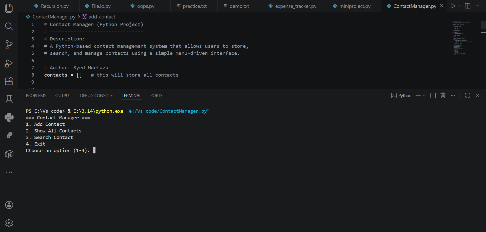

# Contact Manager (Python)

## 📌 Description
This is a Python-based contact manager that allows users to store, search, and manage contacts efficiently using a menu-driven system.

## 🚀 Features
- Add new contacts
- View all contacts
- Search contacts by name
- Simple and user-friendly interface

## 🛠️ Technologies Used
- Python

## 📚 What I Learned
- Data storage using dictionaries
- Search functionality implementation
- Structuring menu-driven programs

## 👨‍💻 Author
Syed Murtaza

## 📸 Screenshot

